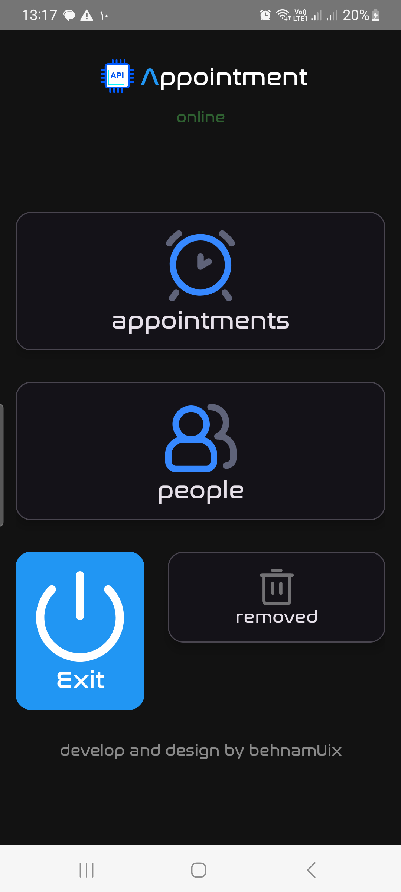
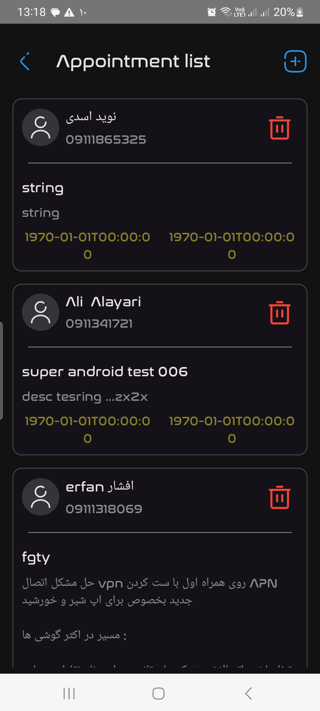
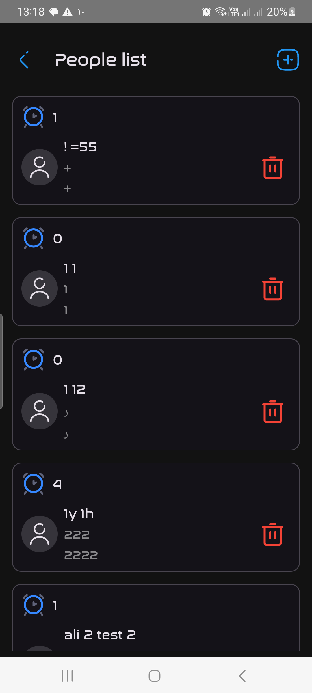

# 📱 Appointment App

A modern Android application built with **Ktor**, **MVVM**, **Koin** and **Jetpack Compose** for managing appointments and fetching data from API.

---

## ✨ Screenshots

  
  
  

---

## 🧠 Tech Stack

- ⚡ Ktor (Networking)
- 🏗 MVVM Architecture
- 💉 Koin (Dependency Injection)
- 🧭 Navigation Component
- 🎨 Jetpack Compose UI
- 🌐 REST API Integration

---

## 📌 Features

- ✔ Appointment management
- ✔ API-based data loading
- ✔ Delete & restore items
- ✔ Clean MVVM structure
- ✔ Offline state handling
- ✔ Modern Compose UI

---

## 🚀 About Project

This project is a practice-level but production-style Android app designed to demonstrate clean architecture, API integration, and modern Android development patterns.

---

🔥 Built with Kotlin & ❤️

